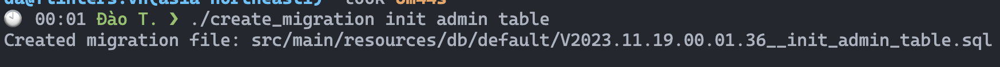

## Scala 3 with ZIO

### Usage

Lần chạy đầu tiên: `sbt start` để migrate các file cần thiết vào db, đồng thời project cũng được dựng lên.
Truy cập [http://localhost:8081](http://localhost:8081/newId) để kiểm tra.


Để sử dụng tính năng hot-reload trong quá trình phát triển, truy cập sbt server
bằng cách chạy `sbt` sau đó gõ `~reStart` để kích hoạt tính năng.

### Migrate DB

khi cần tạo file migration mới, khuyến khích dùng cách sau
để tránh conflict trong (và sau) quá trình merge nhánh:

```shell
./create_migration <tên file cần tạo>
```

Ví dụ:



Khi cần chạy migration thủ công, thực thi lệnh sau:

```shell
sbt run-db-migrations
```
